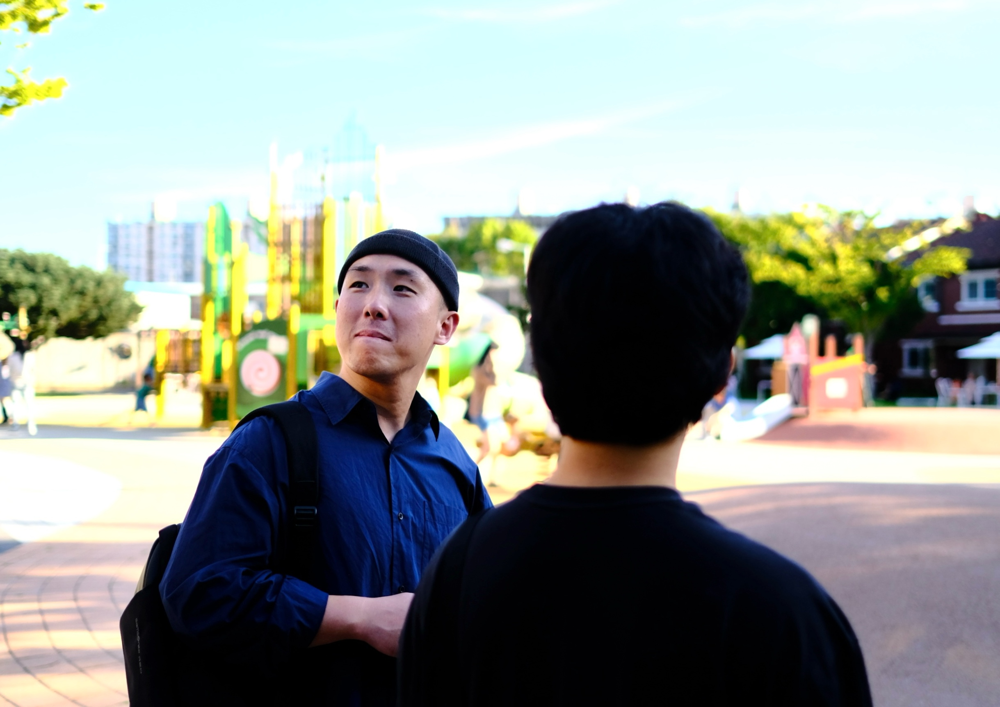

# 안녕하세요.

순수한 마크다운 페이지로 운영하고 있습니다.  
좋은 습관을 만들고 꾸준히 유지하기 위해 무엇을 어떻게 하고 있는지를 **기록**, **공유**하기위해 만들었습니다.

- [LinkedIn](https://www.linkedin.com/in/%EB%AF%BC%EA%B7%9C-%EA%B9%80-aba962126/)
- mechanic0406@gmail.com

## 프론트엔드 챌린지
실무 감각을 유지하면서 역량을 키우기 위해 스스로 만들어 실천하고 있습니다.  
Gemini를 사용하여 챌린지 기획을 합니다. 과제는 Gemini code assist와 함께 진행합니다.

챌린지에 대한 자세한 내용은 [로드맵](https://github.com/MechanicKim/fe-challenge/blob/main/README.md)을 통해 확인하세요.

- [1주차: 인터랙티브 데이터 대시보드 위젯](./fe-challenge/WEEK1.md)
- [2주차: 드래그 앤 드롭 파일 업로더](./fe-challenge/WEEK2.md)
- [3주차: 다국어 지원 시스템 구축 (i18n)](./fe-challenge/WEEK3.md)