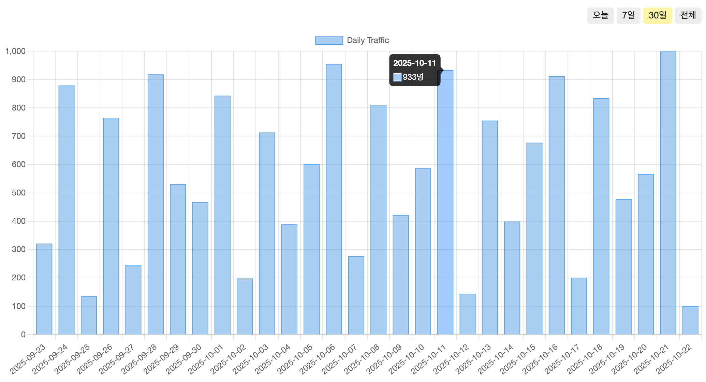

# 1주차 프론트엔드 챌린지: 인터랙티브 데이터 대시보드 위젯

챌린지에 대한 자세한 내용은 [가이드](https://github.com/MechanicKim/fe-challenge/blob/main/apps/week1/README.md)를 참고하세요.

### 25.11.03 - 매번 CSS Module을 사용하면서 느끼는 점

CSS Module은 css 파일을 작성하는 방식이라 CSS in JS 방식 보다 유연하지 못한 점이 있다. 예를 들면 본 과제에서 기간 필터 중 선택한 것을 표시하려면 선택 여부에 따른 스타일 클래스를 넣어줘야 한다는 것이다.

CSS nesting을 사용하여 기간 필터에 기본 스타일 클래스가 없는데, 선택에 따라 배경색을 다르게 하고 싶다고 해보자. 선택한 필터는 selected 클래스를 만들어 추가하면 된다. 선택하지 않은 필터는 어떻게 해야할까? 기본 배경 색을 유지하니 아래와 같이 하면 될까?

`<button className={selected ? styles.selected : ''}>1일</button>`

물론 된다. 다만 개발자 도구를 통해 확인해보면 다음과 같이 보일 것이다.

`<button class>1일</button>`

처음에는 그냥 두었으나 계속 보니 거슬렸다. 선택 여부에 따라 button 요소 부터 다시 작성할까? 결국은 common 클래스를 따로 만들기로 했다.

### 25.11.05 - 다크 모드 작업을 하면서 알게된 것

light, dark 클래스를 canvas에 토글로 설정할 수 있도록 하고, 각 모드에 맞는 요소들의 스타일을 CSS nesting을 사용해 정의하면 될 것이다. 그러나 작업을 하면서 아차 싶었던 것이 있으니

canvas 내부 요소들은 css로 스타일을 지정할 수 없다는 것이다. 결국 canvas 배경과 외부 UI를 제외한 나머지는 Chart.js의 객체를 통해 업데이트를 해야했다.
