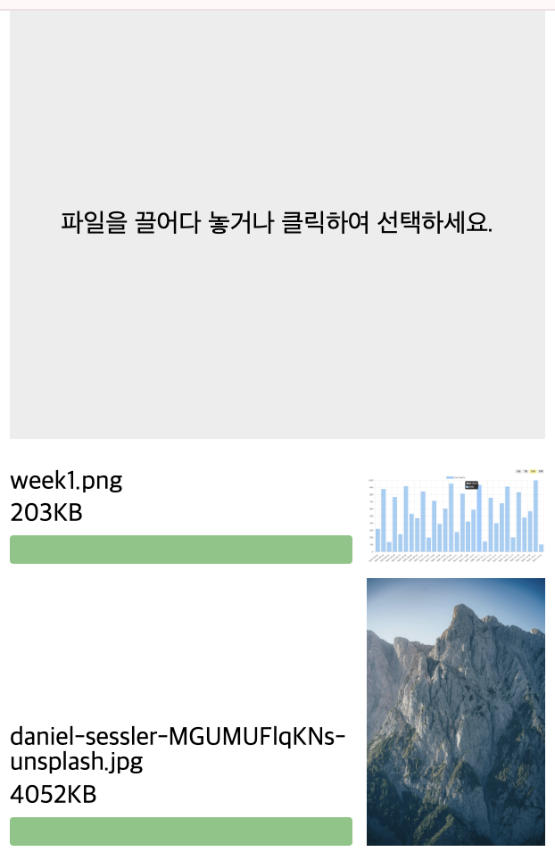

# 2주차 프론트엔드 챌린지: 드래그 앤 드롭 파일 업로더

챌린지에 대한 자세한 내용은 [가이드](https://github.com/MechanicKim/fe-challenge/blob/main/apps/week2/README.md)를 참고하세요.

## 라이브러리, 주요 기술

- 라이브러리: 없음(Vanilla)
- 기술: Drag and Drop API, FileReader API
  - Express API 서버(로컬)에 업로드 요청

## 기록

### 25.11.03 - 재사용 가능한 모듈의 의존에 대하여

재사용이 가능한 모듈을 만드는데 있어 중요한 것 중 하나가 `의존`을 줄이는 것이라는 생각이다. 모듈이 그리는 DOM이 특정 아이디, 클래스에 의존하면 외부에서 같은 아이디, 클래스를 사용하는 경우 충돌이 생기는 등의 문제가 생길 수 있기 떄문이다.

처음 과제를 하고 나서 이러한 의존에 대해 제대로 고려하지 않은 것 같아 다시 작업을 했고, 많은 수정이 있었다.

### 25.11.05 - 다시 작업한 내용

파일을 끌어다 놓는 영역과 업로드 상태를 보여주는 영역은 서로 독립적으로 구분
- 두 영역의 아이디를 옵션으로 받을까 싶었지만 기본 스타일을 CSS 파일로 정의하기 위해 고정하기로 했다.
- 모듈에서 업로드 상태를 보여주는 DOM을 만들어 주는데, 데이터만 제공하고 DOM은 자유롭게 만들어 쓰도록 하는게 어떨까 싶다.

의존을 줄이기 위해 모듈이 그리는 영역 내 클래스를 최소로 사용하기
- 클래스를 사용한 곳은 상태를 보여주는 영역 각 항목의 컨테이너와 진행바다.
- 상태 데이터만 제공하도록 개선하면 모듈은 클래스 의존에서 완전히 벗어날 수 있다.

결국 모듈은 업로드 상태 데이터를 제공하고 이를 자유롭게 활용하는 방식으로 개선했다.
