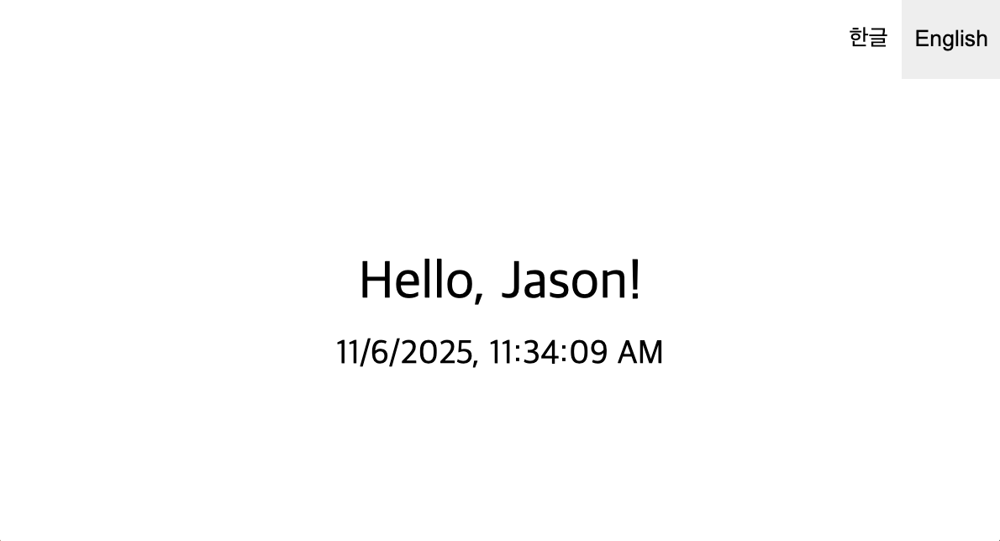

# 3주차 챌린지 가이드: 다국어 지원 시스템 구축 (i18n)

챌린지에 대한 자세한 내용은 [가이드](https://github.com/MechanicKim/fe-challenge/blob/main/apps/week3/README.md)를 참고하세요.

## 라이브러리

- 라이브러리: React, react-intl

## 기록

### 25.11.06 - 기술 보다는 표현

`react-intl`을 사용하지 않고 `Intl API`를 사용해도 기술적 난이도가 크지는 않을 것 같다. 무엇보다 locale에 따라 같은 내용이라도 표현을 어떻게 해야하느냐가 중요하지 않을까?

### 25.11.06 - React 프로젝트 컴포넌트 폴더 구조에 대해

`components` 폴더를 만들고 컴포넌트를 넣는데, 항상 이 두가지를 놓고 고민이었다.

1. components/MyComponent/index.tsx
2. conponents/MyComponent/MyComponent.tsx

1번은 import 경로에서 index를 뺄 수 있어 좋지만 개발을 하면서 수많은 index.tsx 파일을 열었을 경우 불편하다. 2번은 파일 이름이 서로 달라 찾는 불편함은 적지만 import 경로에 컴포넌트 이름 중복이 생긴다.

내 선택은 2번이다. 개인적으로 여러 index.tsx 탭 중 하나를 찾기 불편한 경험을 했으니. 그렇다고 1번이 아니라는 것은 아니다. 불편함을 느끼지 않는 사람들도 분명 있을테니까.

불편함을 해결하는 방법을 찾아 개선하는 방법도 있을텐데, 이걸 고민해 봐야겠다.