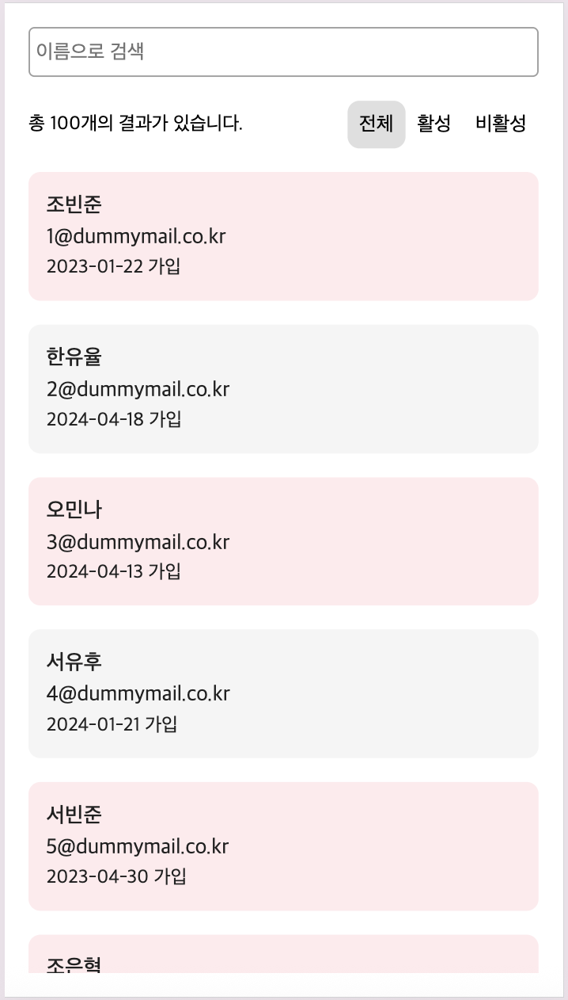
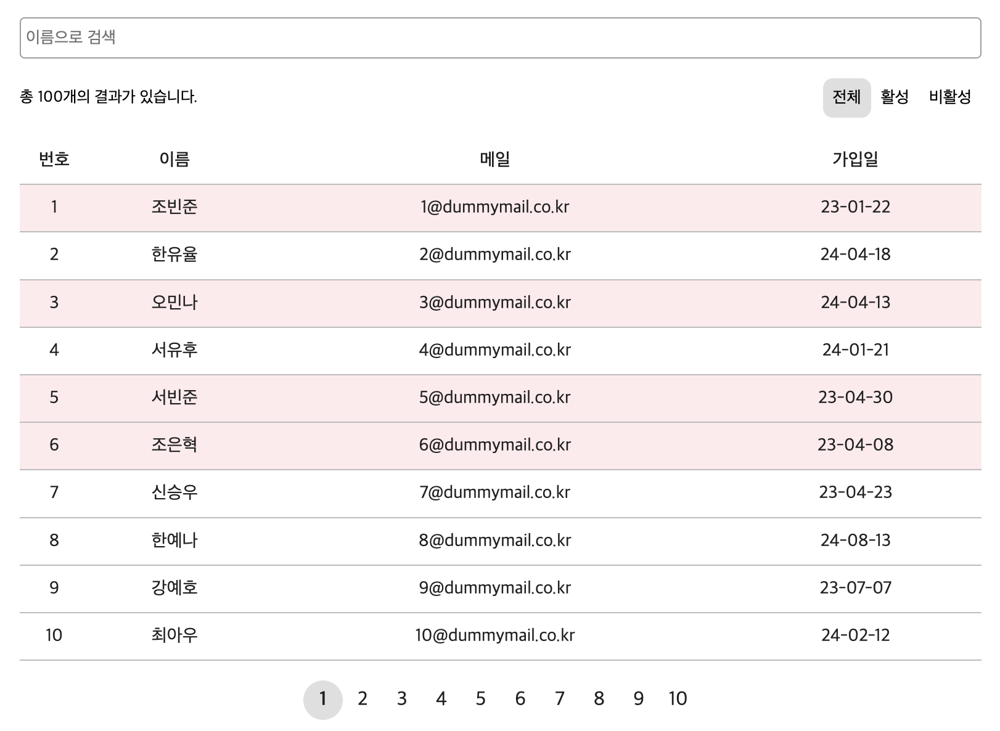

# 4주차 프론트엔드 챌린지: 실시간 검색/정렬을 갖춘 반응형 테이블

챌린지에 대한 자세한 내용은 [가이드](https://github.com/MechanicKim/fe-challenge/blob/main/apps/week4/README.md)를 참고하세요.




## 사용한 라이브러리, 주요 기술, 데이터

- 라이브러리: React
- 기술: CSS Module(스타일링), [Intersection Observer](https://developer.mozilla.org/ko/docs/Web/API/Intersection_Observer_API), [matchMedia](https://developer.mozilla.org/ko/docs/Web/API/Window/matchMedia)
- 데이터: Gemini를 사용하여 만든 가상의 회원 데이터
  - 데이터는 Express API 서버를 만들어 제공

## 기록

### 25.11.06 - 반응형

데스크톱과 모바일 환경에 따라 컴포넌트의 스타일이 아닌 컴포넌트를 다르게 사용해야겠다고 생각했다. 그래서 CSS 미디어쿼리가 아닌 자바스크립트의 matchMedia 메서드를 사용했다.(사실 CSS 미디어쿼리를 써도 된다. 컴포넌트에 클래스를 심어놓고 환경에 맞는 것만 보여주도록 하면 되기 때문이다.)

CSS 미디어쿼리와 matchMedia 메서드의 차이 두 가지를 적어본다.

- CSS 미디어쿼리는 스타일에만 영향을 주지만 matchMedia 메서드는 스크립트에도 영향을 줄 수 있다.
- 브라우저 크기 조절을 하면 CSS 미지어쿼리는 조건에 맞는 스타일을 적용하지만, matchMedia 메서드는 새로고침을 해야한다.

### 25.11.06 - 입력 폼의 디바운싱

디바운싱은 과도한 API 요청을 막기 위해 사용한 것이다. 이때 입력 폼의 값을 업데이트 하는데, 디바운싱이 같이 적용되어서는 안된다. 입력 폼의 값은 바로바로 업데이트하고, 디바운싱 코드를 따로 뚜어 API 요청을 하도록 해야한다.

```
  // onChage 이벤트 발생

  // 입력 폼의 값은 바로바로 업데이트
  setName(e.target.value);

  // 이후 디바운싱을 통해 API 폼 데이터 업데이트
  if (timerRef.current) {
    clearTimeout(timerRef.current);
  }

  timerRef.current = window.setTimeout(() => {
    onChangeFormData({
      name: e.target.value,
    });
  }, 500);
```