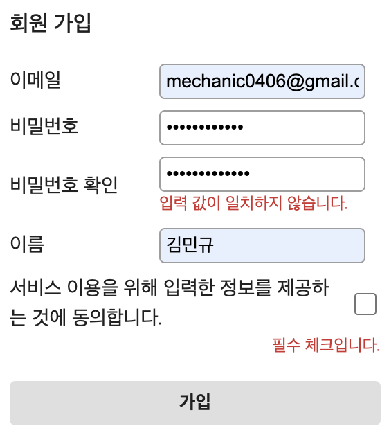

# 5주차 프론트엔드 챌린지: 커스텀 폼 유효성 검사 라이브러리

챌린지에 대한 자세한 내용은 [가이드](https://github.com/MechanicKim/fe-challenge/blob/main/apps/week4/README.md)를 참고하세요.

## 사용한 라이브러리, 주요 기술

- 라이브러리: 없음(Vanilla)
- 기술: [JS Modules](https://developer.mozilla.org/ko/docs/Web/JavaScript/Guide/Modules), [FormData](https://developer.mozilla.org/ko/docs/Web/API/FormData)

## 기록

### 25.11.07 - 데이터 속성에 유효성 검사 규칙을 정의

가이드에 따르긴 했지만 불편하다. 규칙이 복잡하거나 정규식이 길어지면 HTML 자체가 지저분해질수 있으니 말이다. 그래서 제미나이에 이야기를 해보니, 공감하면서 두 가지 대안을 제시해준다.

1. JavaScript 기반의 중앙 집중식 스키마 정의
   - 가장 현대적이고 유연하며, 실무에서 널리 사용되는 방법
   - HTML 마크업을 건드리지 않고, 모든 유효성 검사 규칙을 JavaScript 객체(Schema) 내에서 관리
2. CSS 선택자와 속성 결합
   - 데이터 속성 대신 표준 HTML5 속성과 CSS 클래스를 혼합하여 사용
   - JS에서 폼을 순회하며 이 표준 속성들의 값을 읽어와 검사를 실행

개선 방향으로 1번을 생각하고 있었으니 1번으로 가자!
