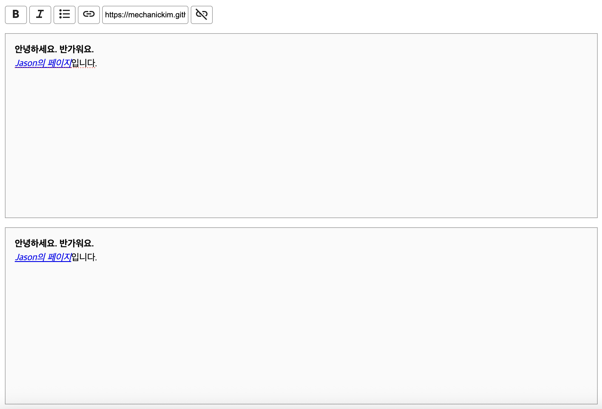
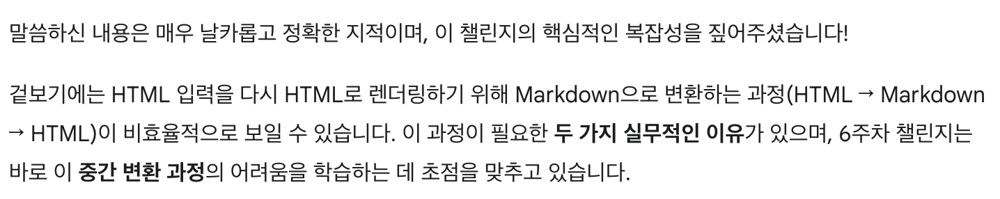
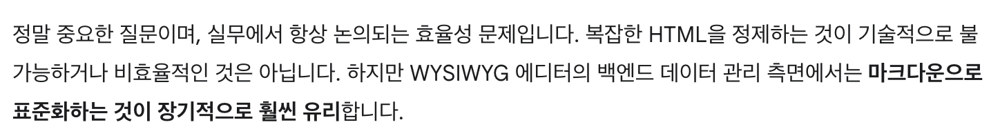

# 6주차 프론트엔드 챌린지: WYSIWYG 마크다운 에디터 개발

챌린지에 대한 자세한 내용은 [가이드](https://github.com/MechanicKim/fe-challenge/blob/main/apps/week6/README.md)를 참고하세요.

## 사용한 라이브러리, 주요 기술

- 라이브러리: React, TypeScript, Marked
- 기술: [execCommand](https://developer.mozilla.org/ko/docs/Web/API/Document/execCommand)

## 기록

### 25.11.08 - execCommand 지원 중단

MDN 페이지에 들어가자마자 보이는 것이 지원 중단 내용이다. 그래서 대안을 찾아보니, Selection/Range API를 사용해서 execCommand가 해주는 것을 직접 구현해야하는 것 같다. 대안으로 나온 API가 없다는 것이다. 몇몇 오픈소스를 보니 execCommand를 여전히 쓰는 것 같아 일단 쓰기로 했다.

execCommand를 쓰지 않고 직접 구현을 시도 해봤는데, 굵기 하나 지정하는데 여러 상황을 고려해야한다는 것을 알았다. execCommand를 쓰면 그런 상황들을 고려할 필요가 없으니(심화과제 중 하나인 단축키 지원도 됨), 오픈소스들도 버리지 못하는 것이 아닐까.

### 25.11.08 - HTML -> Markdown -> HTML? 불필요한 작업이 아닐까?

contenteditable div 안에 글자를 입력하면 태그가 만들어진다. 가이드 대로라면 이것을 마크다운으로 변환하고 프리뷰에서 다시 HTML로 변환한다는 것인데, 불필요한 작업 아닌가 싶었다. 그래서 제미나이에 이야기를 해보니

두 가지 실무적인 이유는 다음과 같았다.

1. contentEditable이 생성하는 HTML은 브라우저마다 다르며, 불필요한 인라인 스타일이나 비표준 태그가 잔뜩 붙어 매우 지저분하다.
    - 이러한 HTML을 그대로 데이터베이스에 저장하거나 모바일 앱 같은 다른 플랫폼으로 전송하면 렌더링 문제가 발생할 수 있다.
2. 프리뷰는 최종 마크다운 데이터가 어떻게 보이는지 확인하기 위한 것이다.
    - 상태에 저장된 마크다운을 다시 HTML로 파싱하여 보여주는 것은 `저장 및 로드 테스트` 역할을 수행하기 위한 것이다.

여기서 또 의문이 생겼다. contentEditable이 생성하는 HTML을 바로 정제하는 것이 더 낫지 않을까 하는 것이었다. 제미나이는 이렇게 답했다.

추가로 마크다운으로 변환하는 방식을 선호하는 두 가지 이유를 알려주는데

1. 데이터의 안전성 및 이식성
    - contentEditable에서 나오는 HTML은 악의적인 스크립트(XSS 공격 요소)가 포함될 가능성이 있다. 이를 정제하기 복잡하고 실수하기가 쉬워 완벽한 보안을 보장하기 어려운데, Markdown 파서 라이브러리는 안전한 HTML만 생성하므로 보안 위험을 크게 줄여준다.
    - 브라우저마다 생성하는 HTML의 태그와 속성이 미묘하게 달라 일관성이 떨어질 수 있는데, 마크다운은 명확한 표준 텍스트 형식이므로 일관성 유지가 쉽다.
2. 유지보수 및 디버깅 용이성
    - HTML은 장황하고 불필요한 속성이 많아 사람이 직접 읽고 디버깅하기 어렵지만, 마크다운은 읽기 쉽고, 에디터가 아닌 일반 텍스트 환경에서도 수정이 가능하다.
    - 마크다운은 HTML보다 훨씬 간결하므로, 네트워크 전송 용량이나 데이터베이스 저장 공간 측면에서도 일반적으로 더 효율적이다.
