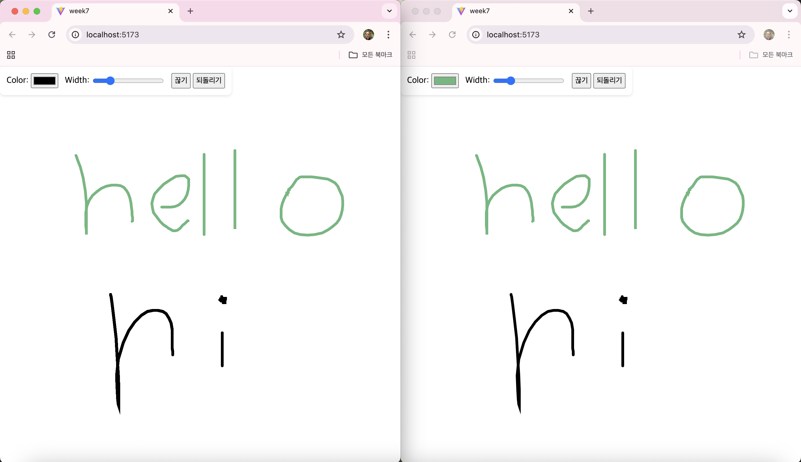

# 7주차 프론트엔드 챌린지: WYSIWYG 마크다운 에디터 개발

챌린지에 대한 자세한 내용은 [가이드](https://github.com/MechanicKim/fe-challenge/blob/main/apps/week7/README.md)를 참고하세요.



## 사용한 라이브러리, 주요 기술

- 라이브러리: React, [Socket.io](https://socket.io/)
- 기술: [HTML Canvas API](https://developer.mozilla.org/ko/docs/Web/API/Canvas_API), WebSocket(Socket.io)
  - Express 서버에 웹 소켓 서버 구축

## 기록

### 25.11.11 - 실시간 동기화를 위한 데이터 구조

캔버스에 선을 그리면 서버에 전달하는 드로잉 데이터의 구조는 타입스크립트 타입 정의로 다음과 같다.

```
interface LineObject {
  timestamp?: number;
  color: string;
  lineWidth: number;
  points: { x: number; y: number }[];
}
```

서버는 연결된 모든 클라이언트에서 받은 드로잉 데이터를 유지해야 한다. 구조는 다음과 같다.

```
interface Drawings {
  [id: string]: {
    [timestamp: number]: LineObject;
  };
}
```

id는 socket 객체를 통해 얻는 id 문자열 값이고 timestamp는 드로잉 데이터의 타임스탬프다.

**왜 timestamp 값을 속성으로 했을까?**

우선 하나의 선을 그리는 과정을 살펴보자.
1. 캔버스에서 마우스 클릭으로 마우스 포인터의 첫 위치 정보를 얻는다.
2. 다음 드로잉을 하면 마우스 포인터 위치가 바뀔 때마다 위치 정보를 얻는다.
3. 마우스 클릭을 해제하면 드로잉이 끝나고 선 하나가 완성된다.

실시간 공유를 위해 마우스 포인터 위치가 바뀔 때마다 서버에 데이터를 전달해야 한다. 이때 서버에서는 하나의 선을 이루는 위치 정보를 구분해야 하는데, timestamp가 그 역할을 하는 것이다.

timestamp 없이 그냥 배열에 위치 정보를 쌓으면 어떻게 될까? 하나의 클라이언트가 그린 모든 선이 이어진 모습으로 캔버스에 그려질 것이다.

**그렇다면 undo를 통한 되돌리기는?**

[Object.keys()](https://developer.mozilla.org/ko/docs/Web/JavaScript/Reference/Global_Objects/Object/keys)를 통해 timestamp를 배열로 얻어 정렬 후 제일 최근 timestamp 속성을 지우면 될 것이다.
