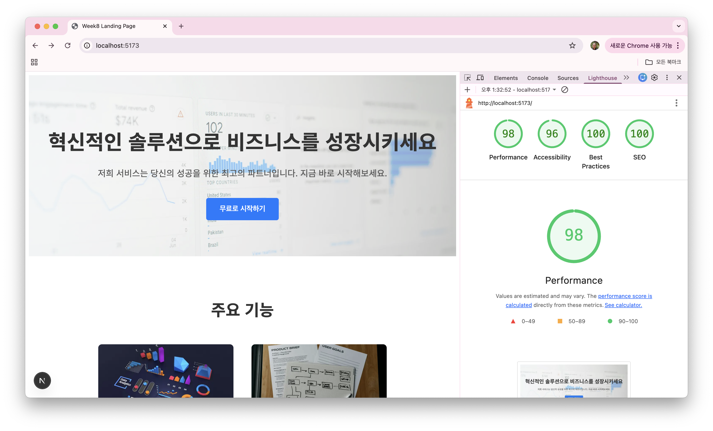

# 8주차 프론트엔드 챌린지: Next/Nuxt 기반의 고성능 랜딩 페이지 목업 구현

챌린지에 대한 자세한 내용은 [가이드](https://github.com/MechanicKim/fe-challenge/blob/main/apps/week8/README.md)를 참고하세요.



## 사용한 프레임워크, 라이브러리

- 프레임워크: Next.js
- 라이브러리: React

## 기록

### 25.11.14 - 이미지 렌더링 방식 개선

기본 img 태그 대신 Next.js에서 제공하는 [Image 컴포넌트](https://nextjs.org/docs/15/app/api-reference/components/image)를 사용하면 로딩을 최적화하여 LCP(Largest Contentful Paint)를 줄일 수 있다.
Image 컴포넌트를 사용한 코드를 보자.

```
<Image
  src="/images/1981-digital-bMWHu8wU1Vk-unsplash.jpg"
  alt="Here background image"
  fill
  priority
/>
```

- `fill`: 상위 요소 크기에 맞춰 이미지를 채운다.(스타일 적용) 부모 요소 position 스타일을 relative(또는 absolute, fixed)로 설정해야 한다.
- `priority`: 로딩 우선순위를 높여준다. 개발자 도구의 네트워크 탭에서 확인하면 사용 여부에 따른 순서 차이를 확인할 수 있다.

Image 컴포넌트가 자동으로 수행하는 최적화는 다음과 같다.

- `WebP 포맷 변환`: 개발자 도구의 네트워크 탭을 통해 응답 헤더를 보면 content-type이 image/webp인 것을 확인할 수 있다.
- `사이즈 최적화`: srcset을 자동으로 만들어주고 뷰포트 너비에 적합한 사이즈의 이미지를 로딩한다. 뷰포트를 변경하면서 개발자 도구의 네트워크 탭에서 이미지 요청 건의 Payload를 확인해보자.
  - Next.js 16 버전에서 이슈가 있었다.(25.11.14) 모바일 해상도에서 이미지 요청시 400에러가 발생했던 것이다. 15에서는 문제가 없는 것을 확인하여 버전을 15로 낮췄다.

Next.js에서 이미지 프록시 역할도 해주고 있다.

### 25.11.15 - 폰트 최적화

Next.js에서 제공하는 [next/font 모듈](https://nextjs.org/docs/15/app/api-reference/components/font)을 사용하여 폰트를 최적화할 수 있다.

```
import { Noto_Sans_KR } from "next/font/google";

const notoSansKr = Noto_Sans_KR({
  subsets: ["latin"],
  weight: ["400", "700"],
});
```

`notoSansKr.className`을 특정 요소의 className에 추가하면 된다.

```
<body className={notoSansKr.className}>{children}</body>
```

이 모듈을 사용해서 얻는 이점은 다음곽 같다.

- `CLS (Cumulative Layout Shift) 방지`: 폰트가 로드되면서 레이아웃이 밀리는 현상이 사라짐. next/font는 폰트 CSS를 인라인으로 삽입하여 렌더링 시점에 폰트 스타일을 즉시 적용.
- `FCP (First Contentful Paint) 개선`: 별도의 폰트 파일 요청이 발생하지 않아 초기 렌더링 속도 향상.
- `개인정보보호`: Google 서버에 직접 요청을 보내지 않으므로 사용자의 IP 주소 등이 노출되지 않음.
  - next/font는 빌드 시점에 폰트를 다운로드하여 자체 호스팅을 하도록 해준다.