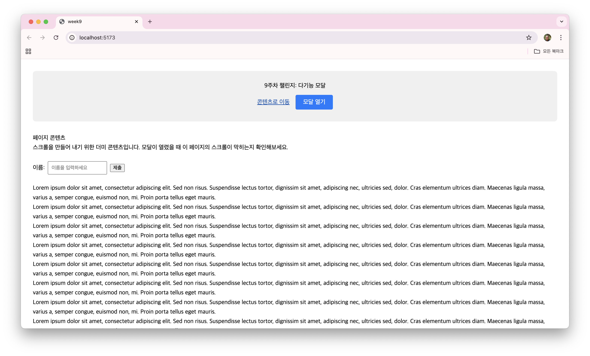
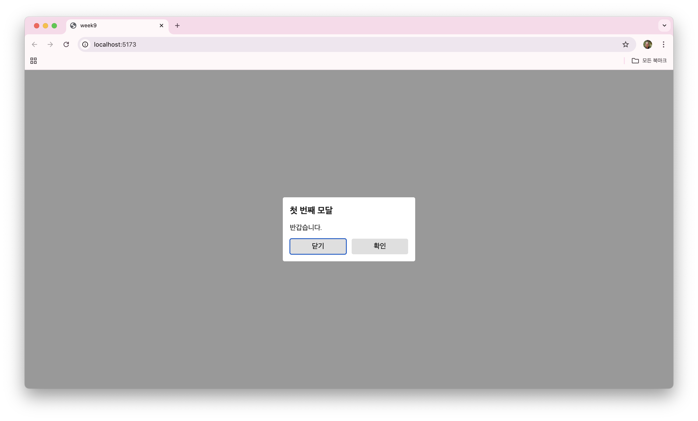

# 9주차 프론트엔드 챌린지: 다기능 모달 컴포넌트 (접근성 및 UX)

챌린지에 대한 자세한 내용은 [가이드](https://github.com/MechanicKim/fe-challenge/blob/main/apps/week9/README.md)를 참고하세요.




## 사용한 라이브러리

- 라이브러리: React, TypeScript

## 기록

### 25.11.17 - 웹 접근성을 위한 포커스 트랩(Focus Trap)

이번 챌린지를 통해 배운 포커스 트랩을(이제야...) 정리해본다.

```
포커스 트랩은 웹 페이지의 특정 영역(주로 모달 다이얼로그, 팝업 창, 또는 특정 위젯)이 활성화되었을 때, 사용자의 키보드 포커스가 그 영역 내부에만 머무르도록 강제로 제한하는 기술이다.
```

왜 필요할까?

1. 컨텍스트 유지
    - 모달 창이 열렸는데도 포커스가 뒤쪽 본문으로 이동해버리면, 스크린 리더 사용자는 현재 모달 창을 닫아야 한다는 사실을 인지하지 못하고 뒤쪽 내용을 탐색하게 되어 혼란을 겪는다.
    - 포커스 트랩은 포커스가 모달 창 내부의 요소들(버튼, 입력 필드)만을 순환하도록 하여, 사용자가 현재 작업 중인 컨텍스트(모달)에 집중하도록 돕는다.
2. 원치 않는 상호작용 방지
    - 모달이 띄워진 상태에서 뒤쪽 본문의 버튼이 실수로 클릭되거나 포커스를 받아 활성화되는 것을 방지한다.
3. 효율적인 이동
    - 키보드 사용자가 탭 키를 눌러 모달 창의 마지막 요소에서 벗어나도, 포커스가 모달 창의 첫 번째 요소로 다시 돌아와(트랩되어) 무한 순환을 만들면서 모달 창 내의 모든 요소에 쉽게 접근할 수 있게 한다.

### 25.11.17 - 모달을 열고, 열고, 또 열고...

커스텀 훅을 하나 만들었다. 모달 정보를 담은 객체 배열을 상태 변수로 하나 만들고 추가하고 빼도록 했다. 어떻게 동작하는지 정리해보면 다음과 같다.

- 빈 배열이면 모달을 띄우지 않는다.
- 모달 정보 객체가 추가되면 마지막 객체로 모달을 띄운다.
- 띄운 모달을 닫으면 배열에서 마지막 객체를 뺸다.
- 빈 배열이 아니면 마지막 객체로 모달을 띄운다.

이렇게 만들고 보니, 모달을 띄우는 건 잘 됐다. 하나를 더 띄우고 닫으니 이전 모달이 보이지 않았다. 확인해보니 렌더링 된 상태에서 opacity가 0이었다. React가 모달 컴포넌트의 속성 중 바뀐 부분만 다시 렌더링을 한 것이 원인이었다. 컴포넌트 자체를 다시 렌더링을 하지 않은 것이다.

이를 해결하기 위해 각 모달 컴포넌트에 다른 key를 속성으로 주었다. key가 다르니 React는 모달 컴포넌트를 다시 렌더링했다. 모달은 잘 보였다.

그렇게 가이드를 만족하는 꽤(?) 단순한 결과물이 나왔다.
